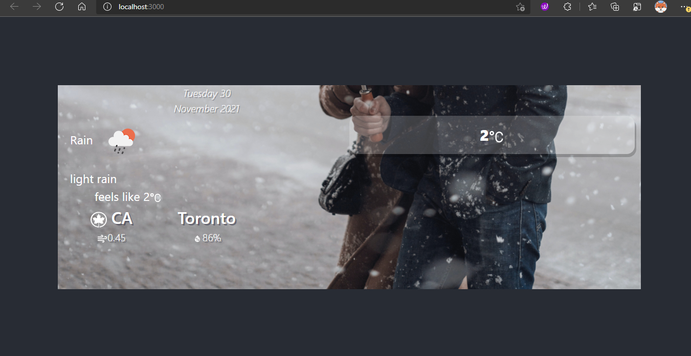

#### This is assignmet2.

Lab Test - 2
COMP 3123 – Full Stack Development I
Total Points (06%)
Submission Deadline: Tuesday, 30th Nov 2021 07:00 PM (Week13)

Note: 
1.	Create git repository name studentid_comp3123_ labtest2
2.	You can use your own preferred free weather API
3.	Create free account if you don’t have one on https://openweathermap.org/ to get API key
4.	Use axios or fetch to access REST API
5.	Please read the response fields detail from https://openweathermap.org/forecast16 
https://openweathermap.org/weather-conditions 
6.	Use following end point to get weather data 
http://api.openweathermap.org/data/2.5/weather?q=Toronto&appid={{APIkey}}

Assignment Details

•	Refer attached JSON file for response

1.	Create a ReactJS application having name studentId_comp3123_labtest2 and connect to GitHub repository (20 Point)

2.	Used icons for weather condition. Refer icons from https://openweathermap.org/weather-conditions (20 Points)

Sample: http://openweathermap.org/img/wn/10d@2x.png

3.	Based on the response from API think of your own UI/UX and display all the information. (40 points)

4.	Display relevant required information from response. Can use any free template for design. (10 Point)
5.	Create ReadMe.md file on GitHub to document and show your screens output. (10 Point)

Submission

A)	Create the ZIP file having all your source code. Remove node_modules folder before zip.

B)	Put the screenshots of all your outputs.

C)	Upload the ZIP file having name studentId_comp3123_labtest2 and GitHub project link on the blackboard on or before the deadline. NO email will be accepted for any late submission of GitHub/screenshots links and source code.

D)	ZERO % will be awarded for a late submission.

Communication

Please contact on pritesh.patel2@georgebrown.ca or SLACK channel for any question or query.

References

https://www.digitalocean.com/community/tutorials/react-axios-react
https://openweathermap.org/forecast16
https://designrevision.com/react-axios/
https://www.smashingmagazine.com/2020/06/rest-api-react-fetch-axios/

